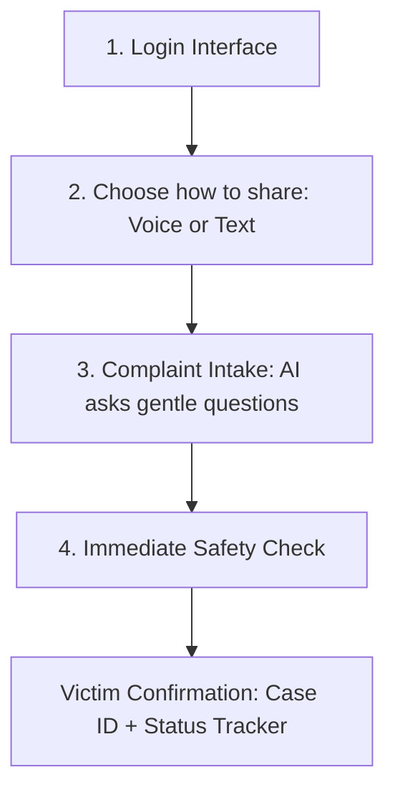
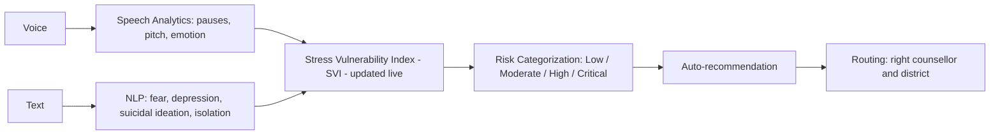

  # AI-Based Real-Time Stress and Trauma Assessment Module for NHAA (14566)

**Smart India Hackathon 2026 | Problem ID: SIH26093 | Software Edition | MedTech / BioTech / HealthTech**
**Ministry of Social Justice and Empowerment (MoSJE) | Department of Social Justice and Empowerment**

## Team: `<SYNTAX SQUAD>`

| # | Member |
|---|--------|
| 1 | Pragati Joshi |
| 2 | Aditi chandra|
| 3 | Saaj Anjelina Topno|
| 4 | Shristi kumari|

---

## 1. Problem Statement

The National Helpline Against Atrocities (NHAA, 14566) is used by victims and complainants who face severe psychological stress, trauma, fear, anxiety and vulnerability. At the time of first contact there is no standard way to assess their psychological condition.

**Module:** an AI-enabled module to assess the psychological stress, trauma, fear, anxiety and vulnerability levels of victims/complainants coming through NHAA.

## 2. Proposed Solution

The solution will:

1. Analyse voice interaction
2. Analyse speech patterns
3. Analyse pitch variation
4. Analyse emotional indicators
5. Analyse textual narratives

**Models / techniques used:**

1. NLP
2. Speech Analytics
3. Emotion AI
4. Stress Vulnerability Index (SVI)

## 2.1 Before vs After

### Before (current NHAA system)
- Toll-free helpline **14566** (voice call/VOIP), a mobile app, and a chatbot on the NHAA website
- A docket number is given for each complaint, and its status can be tracked online
- IVR/operators reply in Hindi, English and regional languages
- Dashboard available for States/UTs
- **The existing chatbot does not measure stress or trauma.**
- There is no standardized mechanism to assess the psychological condition and vulnerability of a victim at the time of first contact.

### After (with our module)

| Before | After |
|--------|-------|
| No standard psychological assessment at first contact | Live **Stress Vulnerability Index (SVI)** for every interaction |
| Chatbot does not measure stress | AI chat intake with speech analytics, NLP and Emotion AI |
| Highly distressed victims can be missed | Risk tags **Low / Moderate / High / Critical** for early identification |
| All cases are treated alike | Priority for critical cases and routing to the right counsellor and district |
| No immediate safety check | Safety check for danger or self-harm, emergency button and location |
| Support decided manually | Auto-recommendation (counselling, etc.), with a human counsellor reviewing every case |
| No risk view for counsellors | Counsellor dashboard with live SVI graph and kanban board |

## 3. Frontend Workflow (Offline App)

### 3.1 Login Interface

**User (victim / complainant) sign-in:**
- Mobile number, with Password or OTP
- Language selection
- Privacy notice
- Name, age, gender

**Stakeholder login:**
- Username
- Password + OTP
- Redirected to their role

After login, the user reaches the AI chat interface (ChatGPT / Gemini-style interface).

### 3.2 Choose How to Share
The victim picks **voice or text**.

### 3.3 Complaint Intake
The AI asks gentle questions, for example: *"What happened? When? Are you safe right now?"*
- **Voice:** captured and transcribed
- **Text:** analysed

### 3.4 Immediate Safety Check
- Checks for danger or self-harm
- Handover to an emergency button
- Location

### 3.5 Victim Confirmation
- Victim gets a **Case ID**
- **Status tracker**

## 4. Backend: Background Analysis

**Voice, Speech analytics** covers:
1. Pauses
2. Pitch
3. Emotion

**NLP** detects:
1. Fear
2. Depression
3. Suicidal ideation
4. Isolation

**Stress Vulnerability Index (SVI), updated live:** a screening score that estimates how much stress/distress and vulnerability a person experiences.

**Risk categorization:** the case is tagged Low, Moderate, High or Critical.

**Auto-recommendation:** the system suggests counselling, etc.

**Routing:** the case goes to the right counsellor and to the district.

## 5. Human Review and Follow-up

- The counsellor reviews the SVI and contacts the victim.
- **The victim should never see the score or risk label.**

## 6. Counsellor Dashboard

- Live SVI graph
- Kanban board (High, Low, etc.)

## 7. Features

1. Categorize victim (Low, Moderate, ...)
2. Detect indicators
3. Automatically recommend ideas (calling agent)
4. Indian languages
5. Privacy and security: consent, ethical AI standard
6. Know your rights
7. Register your complaint
8. Response of helpline and integrated portal ecosystem: faster helpline response, seamless integration, timely escalation

## 8. Stakeholders: One Login Page

Username, then Password + OTP, then redirect to their role.

| Role | What they see |
|------|---------------|
| Counsellor | Assigned cases, SVI, risk flags |
| District Officer | Cases in their district only |
| State Officer | Cases in their state only |
| DoSJE Admin | National aggregate dashboard |
| Police Liaison | Only critical-case referrals |
| Helpline Operator (NHAA 14566) | New cases and case status |
| Rehabilitation / Welfare Officer | Cases referred for rehabilitation support |

## 9. Outcomes

1. **Early identification** of highly distressed victims
2. **Priority** to counselling and rehabilitation
3. **Victim-centric redressal:** right to info, right to be heard, medical and support protocols
4. **Better allocation of support resources:** direct appropriate human support

---
*Prepared for Smart India Hackathon 2026 | Problem ID SIH26093*
  
